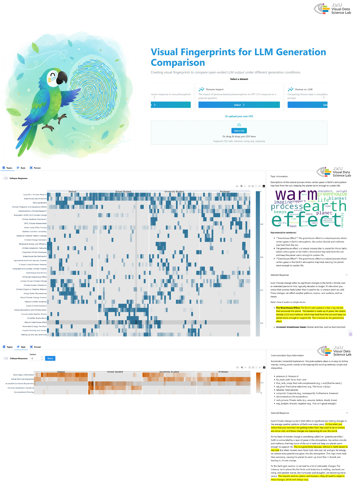

# Visual Fingerprints for LLM Generation Comparison

<p align="center">
  
</p>

<p align="justify">
Large language model (LLM) outputs arise from complex interactions among prompts, system instructions, model parameters, and architecture. We refer to specific configurations of these factors as generation conditions, each of which can bias outputs in various ways. Understanding how different generation conditions shape model behaviors is essential for tasks such as prompt design and model evaluation, yet it remains challenging due to the stochastic and open-ended nature of text generation. We present an approach to visually compare LLM outputs across generation conditions by modeling responses as collections of linguistic choices, including content, expression, and structure. We extract these choices using natural language processing pipelines and represent their distributions across repeated samples. We then visualize these distributions as visual fingerprints, enabling direct, distribution-level comparison of condition-specific tendencies. Through four usage scenarios, we demonstrate how visual fingerprints reveal consistent patterns in LLM behavior that are difficult to observe through individual responses or aggregate metrics.
</p>

## Repository Structure

```
.
├── app/                    # Dash-based application
├── data/
│   ├── scenarios/          # csv files with the LLM responses for the different usage scenarios
│   ├── features.csv        # Descriptions of the grammatical features extracted by Biber's pipeline
├── requirements.txt        # Python dependencies
└── README.md
```

## Installation

```bash
git clone https://github.com/jku-vds-lab/iLLuMinate.git
cd iLLuMinate

python -m venv .venv
source .venv/bin/activate

pip install -r requirements.txt
```

## OpenAI API Key
We use OpenAI models to generate human-readable annotations. Please replace the API key placeholder in `app/analysis/labeling/prompting.py`

```python
client = OpenAI(api_key="sk-XXXXXXXXXXXXXXXX")
```

## Starting the application

```bash
python -m app.app
```

## Paper

This repository accompanies the paper:

**Visual Fingerprints for LLM Generation Comparison**  
Amal Alnouri, Andreas Hinterreiter, Christina Humer, Furui Cheng, and Marc Streit.  
arXiv:2605.06054, 2026.  
https://arxiv.org/abs/2605.06054

## Citation

```bibtex
@misc{alnouri2026visualfingerprintsllmgeneration,
  title={Visual Fingerprints for LLM Generation Comparison},
  author={Alnouri, Amal and Hinterreiter, Andreas and Humer, Christina and Cheng, Furui and Streit, Marc},
  year={2026},
  eprint={2605.06054},
  archivePrefix={arXiv},
  primaryClass={cs.AI},
  doi={10.48550/arXiv.2605.06054}
}
